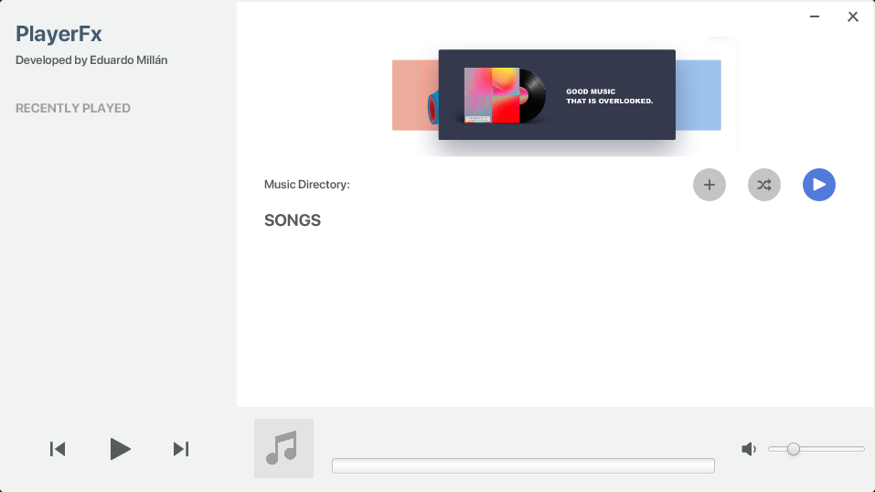
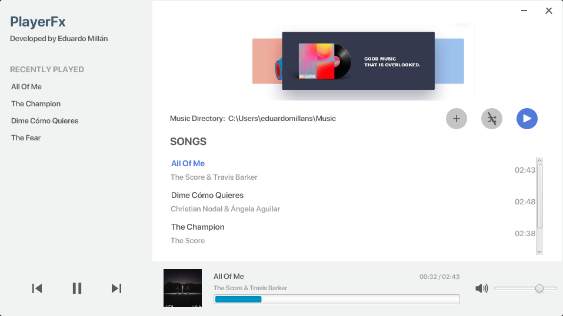

PlayerFx
=============

This is a simple music player made with JavaFx. You can select a directory with mp3 files and play any song you want.

How to use the Project
----------------------

You must have these requirements to be able to compile the project:

* Java JDK 11
* JavaFX SDK 11

You can clone the repository and compile it with this VM option.

```
--module-path "\path\to\javafx-sdk-11\lib" --add-modules javafx.controls,javafx.fxml,javafx.media -Dprism.order=sw
```

More information about [JavaFX](https://openjfx.io/openjfx-docs/) and how to use it.

Screenshots
----------------------




